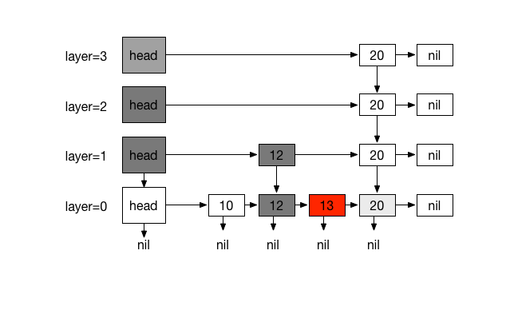
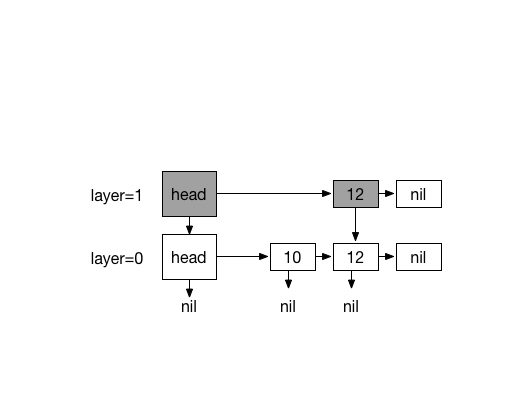
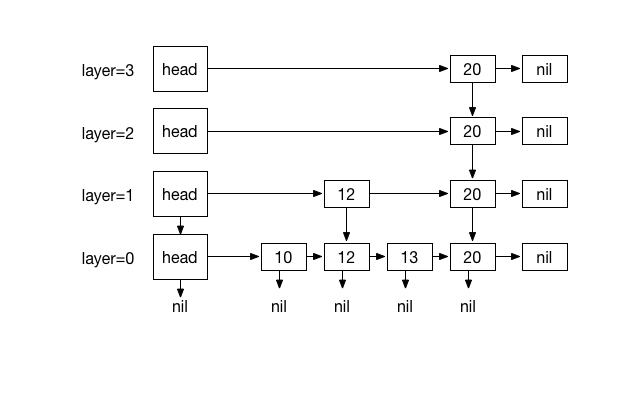

# 跳跃表

跳跃表是一种概率数据结构，与 AVL 或者红黑树有着同样的时间效率，对搜索和更新操作提供了一个聪明的妥协，与其他的图数据结构相比来说更容易实现。

跳跃表 *S* 是由一些有序的链表组成的 *{L0,  ..., Ln}*，这些列表是层级划分的，并且每一层 *L* 存储的是以升序排列的 *L0* 中的元素的子集。层级 *{L1, ... Ln}* 里的元素是用丢硬币的方法以 1/2 的概率随机选择的。对于遍历来说，层中的每个项都保留了下面的节点和下一个节点的引用。这些层就像是它下面层的快速道一样，通过跳过道路和减少距离来使搜索变成 O(log n)，在糟糕的时候，搜索会降到 O(n)，就像普通的链表一样。

跳跃表 *S*：

1. 链表 *L0* 包含每个插入的元素
2. 对于链表 *{L1, ..., Ln}*，*Li* 包含链表 *Li-1* 中的元素的随机子集
3. 高度是由丢硬币决定的。

图 1

# 搜索

搜索元素 *N* 是从遍历最高层 *Ln* 直到 *L0*。

我们的目标是找到当前层的最右边的元素 *K*，它的值比目标项的小，并且它后面的节点的值大于或等于目标项的值或者为 nil（*K.key < N.key  <= (K.next.key or nil)*）。如果 *K.next* 的值等于 *N*，搜索就停止了，返回 *K.next*，否则就用 *K.down* 到下面一层（层 Ln - 1）的节点，然后重复这个过程直到 *L0* ，并且 *K.down* 为 `nil` 的话，表示要找的项不存在。

### 例子

# 插入

插入元素 *N* 和搜索的过程有点像。它是从最高层 *Ln* 遍历到 *L0*。需要用一个栈来保存我们的遍历路径。这可以在丢硬币开始的时候帮助往上遍历，以便我们可以插入新的元素和更新与它相关的引用。

我们的目标是找到当前层的最右边的元素 *K*，它的值比目标项的小，并且它后面的节点的值大于或等于目标项的值或者为 nil（*K.key < N.key  <= (K.next.key or nil)*）。将元素 *K* 放到栈里，然后用 *K.down* 到下面（层 Ln-1）的节点，然后重复这个过程（往前搜索）直到 *L0*，*K.down* 为 `nil` 就表示是 *L0* 了。当 *K.down* 为 `nil` 的时候就结束这个过程。

在 *L0*，*N* 可以插入在 *K* 后面。

这里是插入部分。用丢硬币的方法来随机创建层。

丢硬币方法返回 0，整个过程就结束，如果返回 1，就有两种可能：

1. 栈为空（层级是 *L0* /- *Ln* 或者是初始状态）
2. 栈有内容（可以往上遍历）

情况：

创建一个新的层 M* ，头结点 *NM* 指向下一层的头结点，*NM.next* 指向新元素 *N*。新元素 *N* 指向前一层的元素 *N*。

情况 2：

从栈中弹出项 *F*，直到栈变成空，并且适当的修改引用。每一次都创建一个新的节点 *N*，*N.down* 只想前一层的同一个节点。*N.next* 指向 *F.next*，并且 *F.next* 变成 *N.next* 。
	
当栈空了之后创建一个新的层，头结点 *NM* 指向下一层的头结点，并且 *NM.next* 指向新元素 *N*。新元素 *N* 指向前一层的元素 *N*。
		 

### 例子

插入 13。丢硬币是 0

插入 20。四次丢硬币都是 1

# 删除

移除和插入流程相似。

TODO

# 参考

[跳跃表 维基百科](https://en.wikipedia.org/wiki/Skip_list) 

*作者： [Mike Taghavi](https://github.com/mitghi) 翻译：Daisy*

